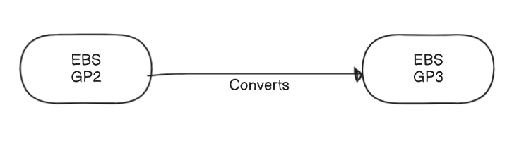

# Project Description

🌥️ Cloud Engineering Marvels 🚀

Welcome to our dynamic Cloud Engineering team, where we expertly manage and secure our AWS environment, ensuring compliance with organizational policies. Our mission is to blend innovation with reliability, and we achieve this with the help of cutting-edge AWS services.

🔍 AWS CloudWatch + AWS Lambda: Guardians of Compliance 🛡️

We leverage the powerful duo of AWS CloudWatch and AWS Lambda to govern our resources seamlessly. Here’s how:

🌟 Automated Resource Management:

Trigger Happy: Whenever an Amazon Elastic Block Store (EBS) volume is created, our finely-tuned Lambda function springs into action. ⚡

Event-Driven Magic: Thanks to Amazon CloudWatch Events, we can monitor every move in our AWS landscape. These events empower us to keep a close eye on EBS volumes of type GP2 and transform them into the more efficient GP3 type, effortlessly.

💡 Our innovative approach ensures that our cloud infrastructure remains optimized and compliant with ease. Join us on this journey of continuous improvement and excellence in cloud management! 🚀🌈
