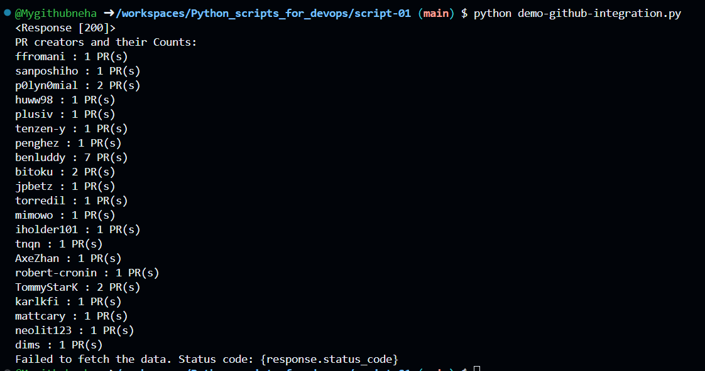

Use Case:

Purpose: To automate the retrieval of pull request data from the Kubernetes GitHub repository and summarize the number of PRs created by each user.

What the Script Does

The script fetches and displays the details of users who have created pull requests (PRs) on the Kubernetes GitHub repository. It shows how many PRs each user has created.

Script output:

